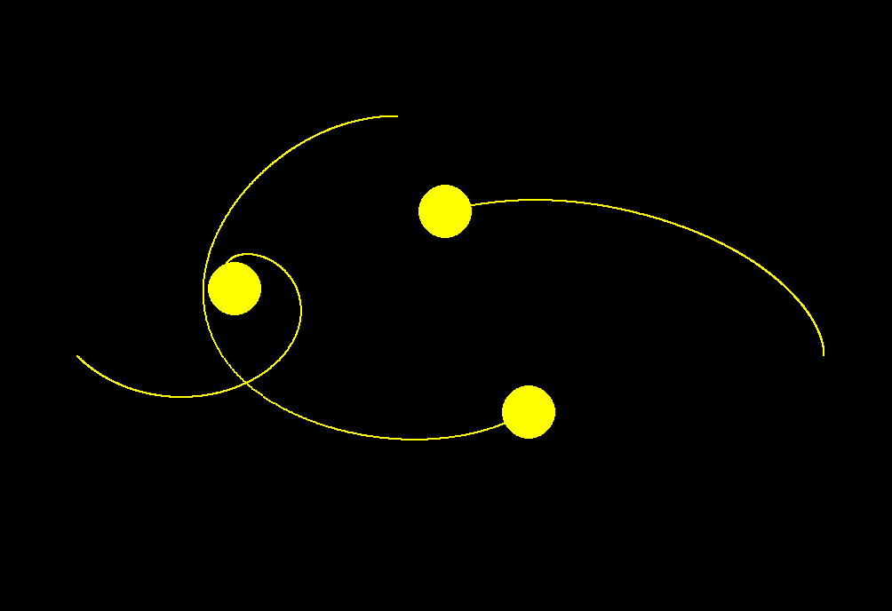

# 3 Body Problem Simulation

This project is a simulation of the 3 body problem using Pygame. It allows you to visualize the motion and interactions of three bodies under the influence of their mutual gravitational forces.`




## Installation

1. Clone the repository:
   ```
   git clone https://github.com/olivernabani/3bodies
   ```

2. Navigate to the project directory:
   ```
   cd 3bodies
   ```

3. Create a virtual environment (optional but recommended):
   ```
   python -m venv venv
   ```

4. Activate the virtual environment:
   - For Windows:
     ```
     venv\Scripts\activate
     ```
   - For macOS and Linux:
     ```
     source venv/bin/activate
     ```

5. Install the required dependencies:
   ```
   pip install -r requirements.txt
   ```

## Usage

1. Run the main script:
   ```
   python main.py
   ```

2. The program will start with a blank screen and the following options:
   - Create: Adds new celestial bodies to the scene.
   - Delete: Removes celestial bodies from the scene.
   - Demo: Places four predefined bodies with interesting characteristics for a simulation.
   - Edit: Accesses the editing menu.
   - Run: Starts the simulation.

3. Creating bodies:
   - Click the "Create" button to add new celestial bodies to the scene.
   - Created bodies can be moved by dragging them with the mouse.
   - Right-click on a body to change its color.

4. Editing bodies:
   - Click the "Edit" button to access the editing menu.
   - In the editing screen, you can adjust the initial velocity of each body by dragging it.
   - Scroll the mouse wheel to adjust the mass of each body.
   - From the editing menu, you can return to the simulation or go back to the creation page.

5. Simulation:
   - Click the "Run" button to access the simulation page.
   - On the simulation page, you can start or stop the simulation as desired.
   - You can also reset the simulation to its initial state.
   - It is possible to return to previous menus from the simulation page.
   - Use the mouse wheel to zoom in/out and click and drag to pan the view.

Feel free to explore and observe the fascinating behavior of the three bodies as they interact gravitationally!